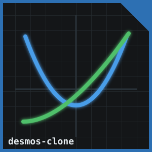

# Raylib Desmos Clone

<p align="center">
  
</p>

A Desmos-style graphing calculator built in C++ using Raylib, compiled to WebAssembly via Emscripten.

**[Live Demo](https://aavishkar331.github.io/Desmos-clone)**

---

## Features

- **Explicit curves** — type `sin(x)`, `x^2`, `tan(x)`, etc.
- **Implicit equations** — type `x^2 + y^2 = 25`, `x - y = 5`, etc.
- **Multiple graphs** — add/delete equations with independent colors
- **Full text editing** — cursor, selection, Ctrl+A/C/X/V, click-to-place, drag-to-select
- **Pan & zoom** — left-click drag to pan, scroll wheel to zoom
- **Mouse hover** — snap dot and (x, y) tooltip on hover
- **Intersection detection** — white dots at crossings between explicit graphs
- **Web build** — runs in the browser via WebAssembly

---

## Tech Stack

| | |
|---|---|
| Language | C++17 |
| Graphics | [Raylib](https://www.raylib.com/) |
| Math parser | [exprtk](https://github.com/ArashPartow/exprtk) |
| Web build | [Emscripten](https://emscripten.org/) |

---

## Architecture

```
App          — owns all subsystems, drives the game loop
├── Cam      — wraps Camera2D; pan, zoom, input blocking
├── Grid     — draws unit-spaced grid lines and axes
├── Graph[]  — renders one curve (explicit polyline or implicit SDF pixel loop)
│   └── Expression  — wraps exprtk; compiles and evaluates math strings
└── EquationPanel   — full text-editing UI sidebar, built from scratch in Raylib
```

Key design points:
- **Implicit rendering** uses a pixel-loop signed-distance-field approximation: evaluates `f(x,y)` at every 2×2 pixel block, computes `dist = |f| / |∇f|` via finite difference, draws if `dist < 4/zoom`. Dirty-flag cached — only re-renders on camera move.
- **Move-safe Expression** — exprtk binds variables by address. Move constructor/assignment recompile against the new object's own stack variables to avoid dangling pointers.
- **Intersection detection** — sign-change scan + 16-step bisection across the visible X range.

---

## Build

### Desktop (Linux)

```bash
g++ Expression.cpp Grid.cpp Cam.cpp Graph.cpp EquationPanel.cpp App.cpp \
    -o desmos -lraylib -lGL -lm -lpthread -ldl -lrt -lX11
./desmos
```

### Web (Emscripten)

Requires [emsdk](https://emscripten.org/docs/getting_started/downloads.html) and Raylib compiled for web:

```bash
# compile Raylib for web (once)
cd ~/raylib/src && make PLATFORM=PLATFORM_WEB -B

# build
em++ Expression.cpp Grid.cpp Cam.cpp Graph.cpp EquationPanel.cpp App.cpp \
    -o index.html \
    -I ~/raylib/src \
    ~/raylib/src/libraylib.web.a \
    -s USE_GLFW=3 \
    -s TOTAL_MEMORY=67108864 \
    -s FORCE_FILESYSTEM=1 \
    -DPLATFORM_WEB \
    --shell-file ~/raylib/src/minshell.html

emrun index.html
```

---

## Expression Syntax

Uses exprtk — note a few differences from standard math notation:

| Write | Not |
|---|---|
| `abs(x)` | `\|x\|` |
| `sin(x)` | `y = sin(x)` (omit the `y=`) |
| `x^2 + y^2 = 25` | implicit equations need the `=` sign |

---

## Attributions

| Library | Author | License |
|---|---|---|
| [Raylib](https://github.com/raysan5/raylib) | Ramon Santamaria ([@raysan5](https://github.com/raysan5)) | [zlib](https://github.com/raysan5/raylib/blob/master/LICENSE) |
| [exprtk](https://github.com/ArashPartow/exprtk) | Arash Partow | [MIT](https://github.com/ArashPartow/exprtk/blob/master/readme.txt) |
| [Emscripten](https://github.com/emscripten-core/emscripten) | Emscripten contributors | [MIT](https://github.com/emscripten-core/emscripten/blob/main/LICENSE) |
